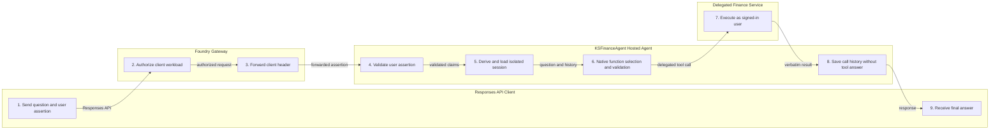
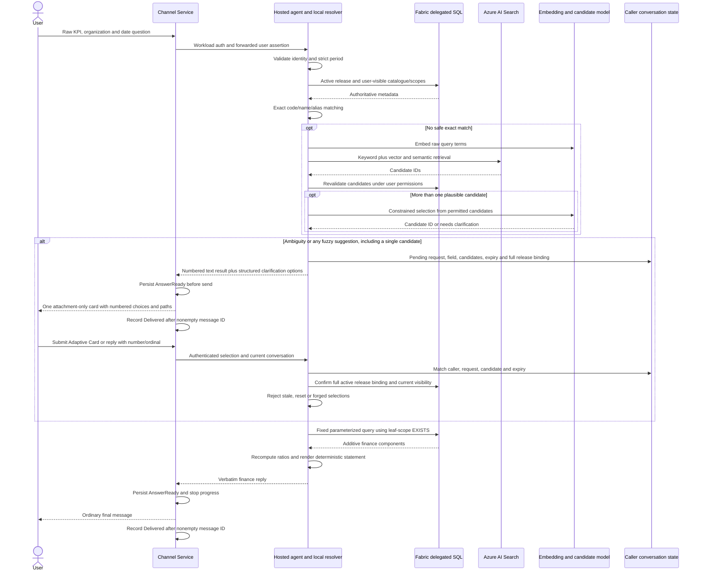

# KSFinanceAgent Swimlane Diagram

This swimlane shows the Teams and Microsoft 365 Copilot request path. It highlights the immediate acknowledgement, durable background processing, hosted-agent routing, delegated tool execution, and proactive delivery.

## Teams and Microsoft 365 Copilot Turn

```mermaid
flowchart LR
    subgraph SwimUser["User"]
        sUserAsk["1. Ask finance question"]
        sUserAck["7. See working message"]
        sUserAnswer["22. Receive answer or clarification card"]
    end
    subgraph SwimBot["Teams and Bot Service"]
        sBotForward["2. Forward signed activity"]
        sBotAck["6. Deliver acknowledgement"]
        sBotFinal["21. Deliver proactive message"]
    end
    subgraph SwimChannel["KSFinanceAgent Channel"]
        sAuth["3. Validate Bot Service JWT"]
        sIdentity["4. Resolve signed-in user"]
        sPending["5. Save pending turn"]
        sSchedule["8. Schedule durable turn"]
        sResume["10. Resume conversation"]
        sCallAgent["11. Call Foundry Responses API"]
        sCache["19. Cache typed reply as answer-ready"]
        sSend["20. Send proactive answer"]
        sDelivered["23. Record delivered"]
    end
    subgraph SwimDurable["Durable Task"]
        sStart["9. Start retryable activity"]
        sComplete["24. Complete orchestration"]
    end
    subgraph SwimFoundry["Foundry Hosted Agent"]
        sGateway["12. Authorize channel workload"]
        sValidate["13. Validate user assertion"]
        sLoad["14. Load isolated session"]
        sRoute["15. Native function selection and validation"]
        sPersist["18. Save call history without tool answer"]
    end
    subgraph SwimFinance["Delegated Finance Service"]
        sObo["16. Exchange token on behalf of user"]
        sTool["17. Resolve statement terms or query selected service"]
    end

    sUserAsk -->|"message"| sBotForward
    sBotForward -->|"activity"| sAuth
    sAuth -->|"trusted caller"| sIdentity
    sIdentity -->|"derived session key"| sPending
    sPending -->|"acknowledge first"| sBotAck
    sBotAck -->|"neutral progress"| sUserAck
    sPending -->|"turn reference"| sSchedule
    sSchedule -->|"instance request"| sStart
    sStart -->|"activity callback"| sResume
    sResume -->|"question and user assertion"| sCallAgent
    sCallAgent -->|"managed identity authorization"| sGateway
    sGateway -->|"forward client header"| sValidate
    sValidate -->|"trusted tenant and user"| sLoad
    sLoad -->|"question and history"| sRoute
    sRoute -->|"validated function call"| sObo
    sObo -->|"delegated access token"| sTool
    sTool -->|"verbatim answer or typed clarification"| sPersist
    sPersist -->|"response body"| sCache
    sCache -->|"reuse cached answer on retry"| sSend
    sSend -->|"ordinary message"| sBotFinal
    sBotFinal -->|"final response"| sUserAnswer
    sBotFinal -->|"send confirmed"| sDelivered
    sDelivered -->|"success"| sComplete
```

<!-- mermaid-checked: no \n, no em-dash/en-dash, no {} in labels, subgraphs are id["label"], arrows are -->|"label"|, all subgraphs closed by end, ids unique -->

## Direct Responses API Turn

Direct clients bypass the channel and Durable Task. They call the same Foundry hosted agent, which still validates the forwarded user assertion, derives isolated state, routes one tool, and uses delegated downstream access.

<!-- mermaid-checked: no \n, no em-dash/en-dash, no {} in labels, subgraphs are id["label"], arrows are -->|"label"|, all subgraphs closed by end, ids unique -->

Tool answers go directly to the client without another model generation step. Only content-free
function-result markers enter the model's conversation history, keeping subsequent calls valid
without retaining permissioned finance responses.

Channel acknowledgement, progress and final answers use ordinary messages, not in-place
streaming. Delivered records suppress later retries, but a crash between sending and persisting
delivery can still duplicate an external message. Clarification cards are ordinary final
messages for their turn; a selection starts a new authenticated turn.

## Statement resolution and clarification

The final SQL path is entered only after **all** required terms are resolved. If one field
still needs clarification, return another prompt rather than running the statement. Direct
Responses clients receive readable numbered options; negotiated channel clients receive the
typed envelope, and the Channel Service builds the Adaptive Card from its structured options.
Numbered result text remains available. Publication and retrieval never replace delegated
financial authorization. The release binding includes catalogue version, Search index,
embedding deployment and embedding dimensions; changing any field invalidates an old choice.
